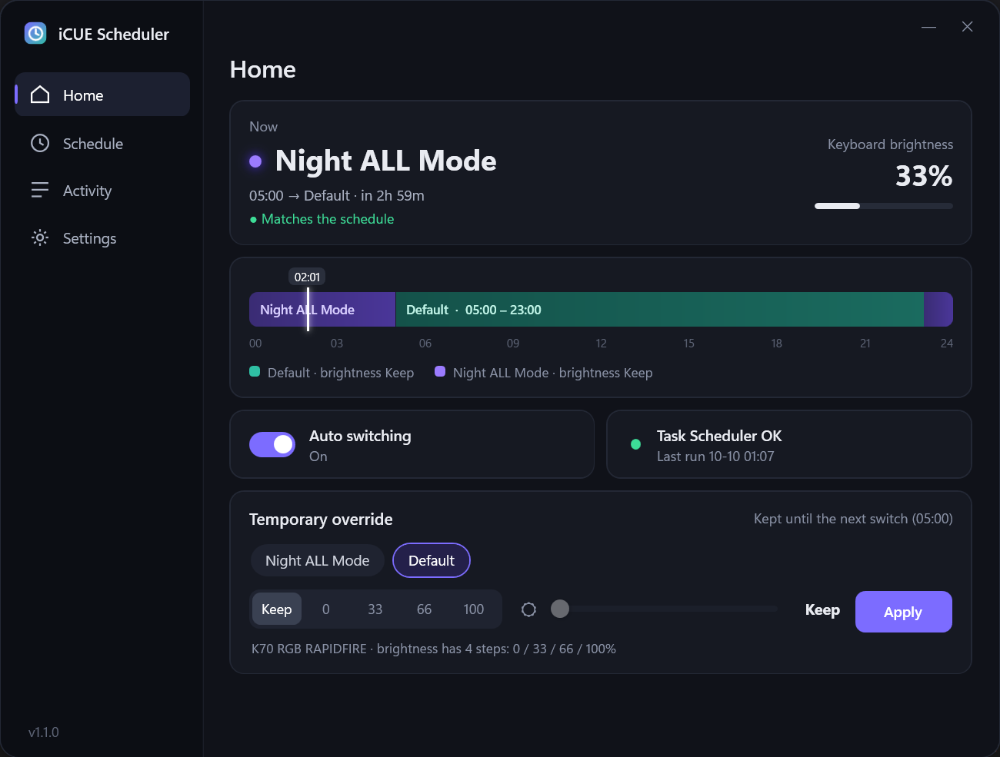
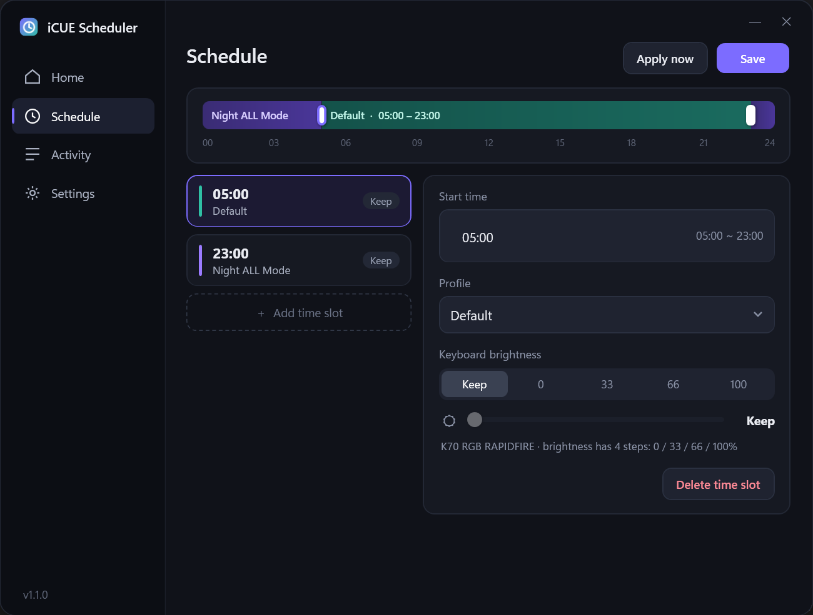
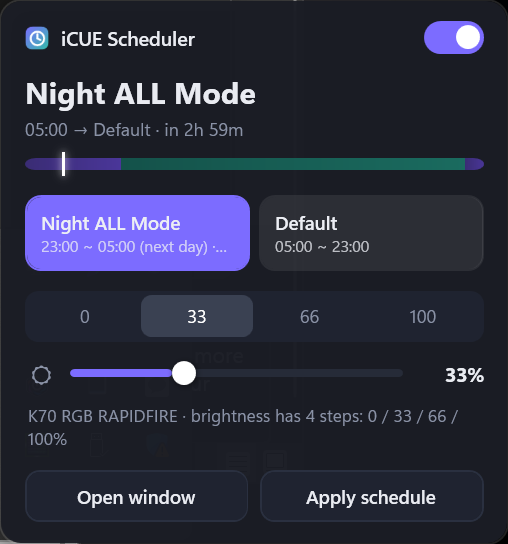

# iCUE Scheduler

시간대에 따라 Corsair iCUE 5 프로필과 키보드 밝기를 자동으로 바꿔 주는 도구입니다.
Windows 전용이며 PowerShell + WPF로 동작합니다. 따로 설치할 프로그램은 없습니다.

[English](README.md) | **한국어**

<p align="center"></p>

## 기능

- **24시간 타임라인.** 어느 시간대에 어떤 프로필이 켜지는지 현재 시각 표시와 함께 보여 줍니다.
- **시간대.** 원하는 만큼 추가할 수 있고, 시간대마다 프로필과 키보드 밝기(선택)를 정합니다.
- **키보드 밝기.** 유지 / 0 / 33 / 66 / 100 % 버튼과, 같은 단계에 맞춰 움직이는 슬라이더로 정합니다. 감지한 키보드 이름과 지원 단계를 함께 보여 줍니다.
- **임시 사용.** 지금 다른 프로필이나 밝기를 쓰고, 다음 전환 시각이 되면 스케줄로 자동 복귀합니다.
- **직접 바꾼 설정 유지.** 각 시간대는 한 번만 적용합니다. 그래서 iCUE에서 직접 바꾼 설정은 다음 시간대가 시작될 때까지 그대로 유지됩니다.
- **놓친 전환 보정.** 로그온하거나 절전에서 깨어날 때, 놓친 전환이 있으면 적용합니다.
- **트레이 위젯(선택).** 작업 표시줄에서 클릭 한 번으로 전환합니다.
- 영어/한국어 UI를 지원합니다.
- 스케줄 자체는 Windows 작업 스케줄러가 실행하므로 계속 켜 둘 프로그램이 없습니다.

<p align="center"> </p>

## 요구 사항

- Windows 10 / 11
- Corsair iCUE 5 (5.51 기준으로 개발)
- Windows PowerShell 5.1 (Windows 기본 포함)

## 설치

1. 저장소를 내려받아(**Code → Download ZIP** 또는 `git clone`) 옮기지 않을 위치에 둡니다. 예: `Documents\iCUE-Scheduler`
2. ZIP으로 받았다면 파일 차단을 한 번 풀어 주세요. 폴더에서 PowerShell을 열고 다음을 실행합니다.
   ```powershell
   Get-ChildItem -Recurse | Unblock-File
   ```
3. 설치 스크립트를 실행합니다. 관리자 권한은 필요 없습니다.
   ```powershell
   powershell -ExecutionPolicy Bypass -File .\Install.ps1
   ```
   작업 스케줄러에 **iCUE Profile Scheduler** 작업이 등록되고, 바탕화면에 **iCUE Scheduler** 바로가기가 생깁니다.
4. **iCUE Scheduler**를 열고 **스케줄** 탭에서 시간대를 정한 뒤 **저장**을 누릅니다.
   프로필 이름은 iCUE에서 가져오므로, iCUE에서 프로필을 먼저 만들어 두세요.

## 화면 구성

| 탭 | 설명 |
|---|---|
| **홈** | 현재 프로필과 밝기, 오늘의 타임라인, 자동 전환 켜기/끄기, 작업 스케줄러 상태, 임시 사용 |
| **스케줄** | 타임라인과 시간대 목록. 시간대를 고르면 시작 시각, 프로필, 밝기를 편집할 수 있습니다. **저장**은 스케줄을 저장하고 작업 스케줄러를 갱신하고, **지금 적용**은 현재 시간대 설정을 바로 적용합니다 |
| **기록** | 전환 내역 (최신순) |
| **설정** | 언어, 트레이 위젯, Windows 시작 시 트레이 위젯 실행, 폴더 열기, 작업 스케줄러 다시 등록 |

각 시간대는 시작 시각부터 다음 시작 시각 전까지 적용되고, 자정을 넘겨 이어집니다.
예를 들어 `07:00 Default`, `23:00 Night`라면 23:00부터 다음 날 07:00까지 *Night*를 씁니다.

### 트레이 위젯 (선택)

**설정 → 트레이 위젯 사용**에서 켭니다. 트레이 아이콘을 왼쪽 클릭하면 프로필 타일, 밝기 조절,
미니 타임라인이 있는 빠른 패널이 뜨고, 오른쪽 클릭하면 메뉴가 나옵니다.
여기서 고른 설정은 다음 전환 시각까지 유지되는 임시 사용입니다.
켜 두면 백그라운드에 상주하지만, 시간대 전환은 트레이 위젯 없이도 동작합니다.

## 동작 방식

iCUE에는 활성 프로필을 바꾸는 공개 API가 없습니다. 그래서 전환할 때마다 다음 순서로 처리합니다.

1. iCUE를 종료합니다.
2. `%APPDATA%\Corsair\CUE5\config.cuecfg`의 `defaultProfile` 값을 바꿉니다. 밝기를 정한 경우 `BrightnessLevel`도 바꿉니다. 바꾸기 전 파일은 `config.cuecfg.bak`으로 보관합니다.
3. iCUE를 다시 실행합니다.

iCUE가 재시작되는 몇 초 동안 조명이 꺼집니다.

작업 스케줄러는 각 시작 시각, 로그온할 때, 절전에서 깨어날 때 실행됩니다.
현재 시간대 설정은 그 시간대에서 아직 적용하지 않았을 때만 적용합니다.

## 명령줄 사용

```powershell
.\Switch-iCUEProfile.ps1                                        # 작업 스케줄러가 실행하는 명령
.\Switch-iCUEProfile.ps1 -Force                                 # 현재 시간대 설정을 지금 적용
.\Switch-iCUEProfile.ps1 -ProfileName "Gaming" -Brightness 66   # 임시 사용 (-Brightness keep = 밝기 유지)
```

## 파일 구성

| 파일 | 역할 |
|---|---|
| `iCUE-Scheduler.vbs` | 콘솔 창 없이 앱을 엽니다 (바탕화면 바로가기가 이 파일을 가리킵니다) |
| `iCUE-Tray.vbs` | 트레이 위젯을 실행합니다 |
| `ui/` | 앱 코드: `MainWindow`, `Tray`, 공용 `Common.ps1`, `Theme.xaml` |
| `Switch-iCUEProfile.ps1` | 실제 전환을 수행합니다 |
| `run-hidden.vbs` | 작업 스케줄러가 콘솔 창 없이 전환 스크립트를 실행하게 합니다 |
| `Install.ps1` / `Uninstall.ps1` | 작업 스케줄러 작업과 바로가기를 등록하거나 제거합니다 |
| `schedule.example.json` | 처음 설치할 때 `schedule.json`으로 복사되는 기본 설정 |
| `schedule.json`, `state.json`, `scheduler.log` | 내 설정, 마지막 적용 상태, 기록 (로컬에서 생성되며 git에는 올라가지 않습니다) |

## 폴더 이동 / 제거

- **폴더를 옮겼다면** `Install.ps1`을 다시 실행하거나 **설정 → 작업 스케줄러 다시 등록**을 누르세요.
- **제거:** `Uninstall.ps1`을 실행한 뒤 폴더를 지우면 됩니다.

## 참고 및 제한 사항

- 전환할 때마다 iCUE가 재시작됩니다.
- **밝기는 0 / 33 / 66 / 100 % 4단계입니다.** K70 RGB RAPIDFIRE 같은 키보드에서 iCUE가 쓰는 단계라서(10 %는 0 %, 50 %는 66 %로 바뀜) 버튼과 슬라이더도 이 단계로만 움직입니다. 밝기 조절 아래에 감지한 키보드 이름이 표시되고, iCUE가 요청과 다른 값으로 저장하면 적용 후 알려 줍니다.
- 밝기는 iCUE의 장치 밝기 설정을 사용하며, 이 설정이 있는 모든 장치에 적용됩니다.
- 공개 문서가 없는 iCUE 자체 설정 파일을 읽고 고칩니다. 앞으로 iCUE가 업데이트되면서 파일 형식이 바뀌면 동작하지 않을 수 있습니다.
- 프로필 이름은 iCUE와 정확히 같아야 합니다. 이름을 찾지 못하면 앱이 알려 줍니다.

## 면책

비공식 도구이며 Corsair와 관련이 없고 Corsair의 승인을 받지 않았습니다. iCUE는 Corsair의 상표입니다.
사용에 따른 책임은 사용자에게 있습니다. 설정을 바꾸기 전마다 iCUE 설정 파일을 백업합니다.

## 라이선스

[Apache License 2.0](LICENSE)